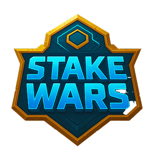

# 🎮 Stake Wars(A Crypto Combat Arena): PvP Battle Game

  

A blockchain-based battling game where players stake SOL, choose unique characters, and engage in dice-driven tactical combat on the Solana chain.

## 🌟 Key Features
- **Multi-Chain Battles** 🔗  
  Powered by Reown AppKit multichain feature for seamless cross-chain interactions
- **SOL Staking** 💰  
  Risk SOL tokens to challenge opponents with 2x reward potential
- **Character System** 🦸  
  4 unique characters with special abilities (Donald Pump, Vladmir Muffin, etc.)
- **Dice-Based Strategy** 🎲 
  Dynamic combat system combining chance and skill
- **Real-Time Firebase Sync** 🔥  
  Live battle tracking and game state management

## 🛠 Tech Stack
- **Blockchain**: Reown AppKit (Multi-Chain), Solana Program Library
- **Frontend**: Next.js 14, TypeScript, Tailwind CSS
- **Backend**: Firebase Firestore, Cloud Functions
- **Auth**: AppKit Wallet Connection (EOA & Smart Accounts)
- **State Management**: Zustand

## 🎮 Gameplay Overview

### 🛡️ Setup Phase

1. **Wallet Connection**
   - Connect multi-chain wallet using Reown AppKit
   - Supported chains: Solana, Ethereum

  

2. **Stake SOL**

  

## ⚔️ Combat Phase
The combat phase is where players engage in tactical battle using their chosen characters and dice rolls.

### 🔄 Turn Sequence

  

    
    
  

